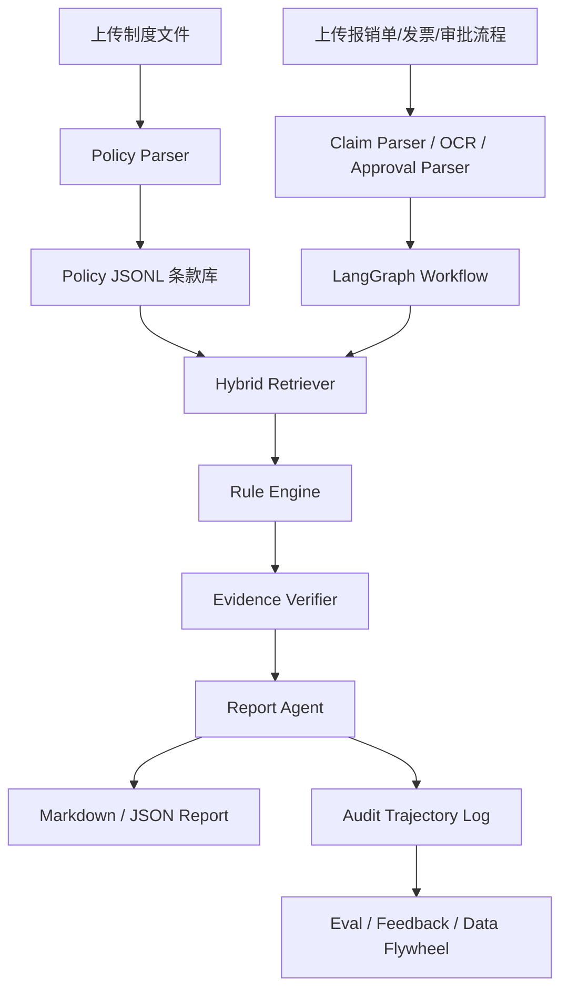

# 系统架构

## 分层说明

| 层级 | 目录 | 职责 |
| --- | --- | --- |
| UI/API | `fin_compliance/app` | Streamlit 页面和 FastAPI 接口 |
| Agent | `fin_compliance/agents` | 工作流编排、规划、路由、报告生成 |
| Domain | `fin_compliance/domain` | 业务 schema、风险类型、metadata |
| Parser | `fin_compliance/parsers` | 制度、报销单、发票、审批、合同解析 |
| RAG | `fin_compliance/rag` | 检索、改写、重排、引用校验 |
| Tools | `fin_compliance/tools` | 规则引擎、计算、报告写入 |
| Eval | `fin_compliance/eval` | 测试集和指标计算 |
| Data Flywheel | `fin_compliance/data_flywheel` | 轨迹、反馈、难例、合成数据 |
| Post Training | `fin_compliance/post_training` | SFT/DPO/Reward 数据构建 |
